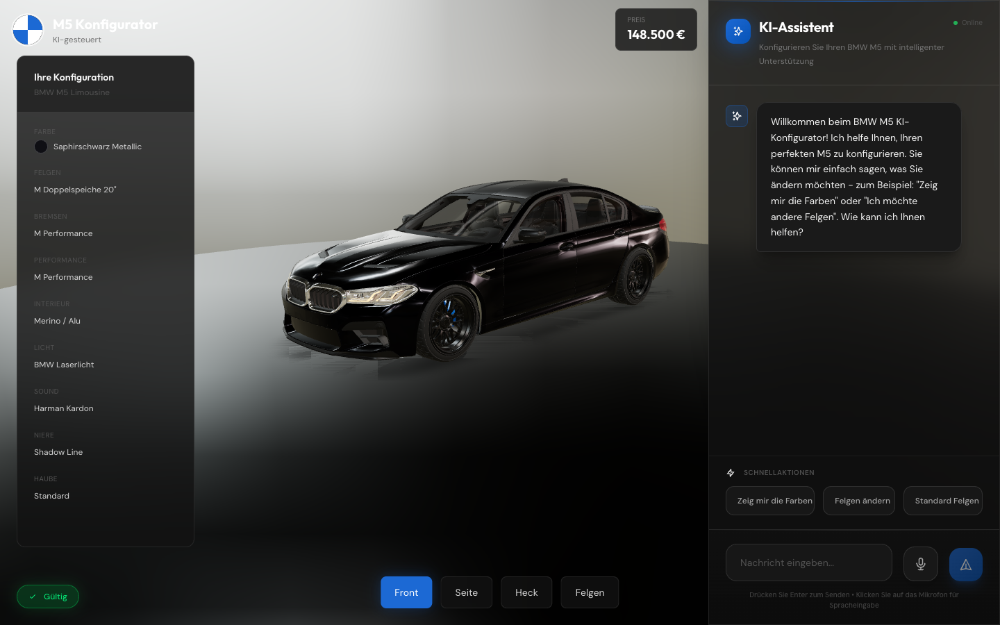
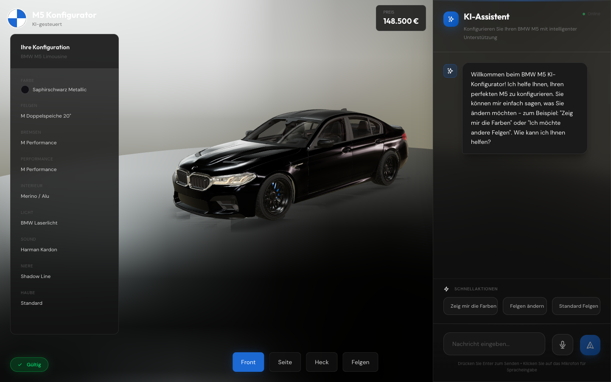
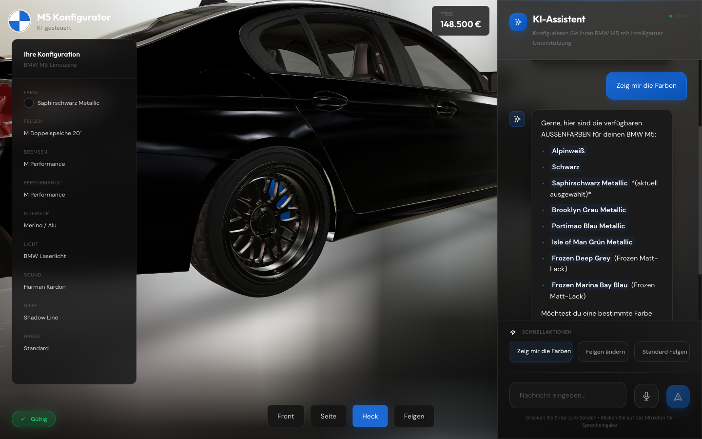
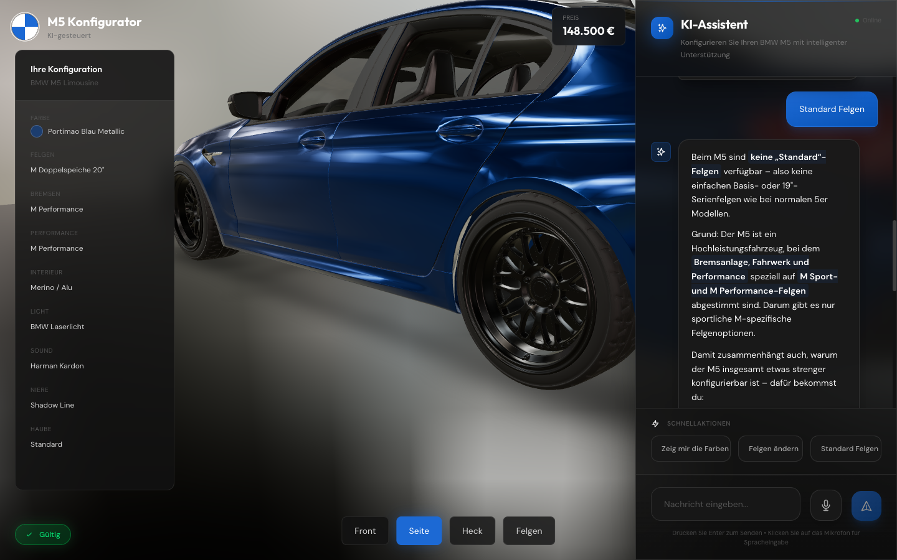
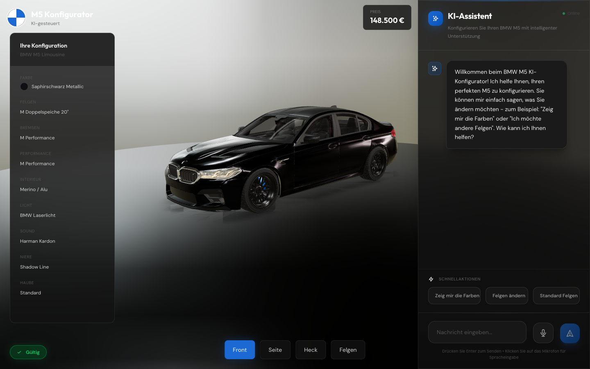
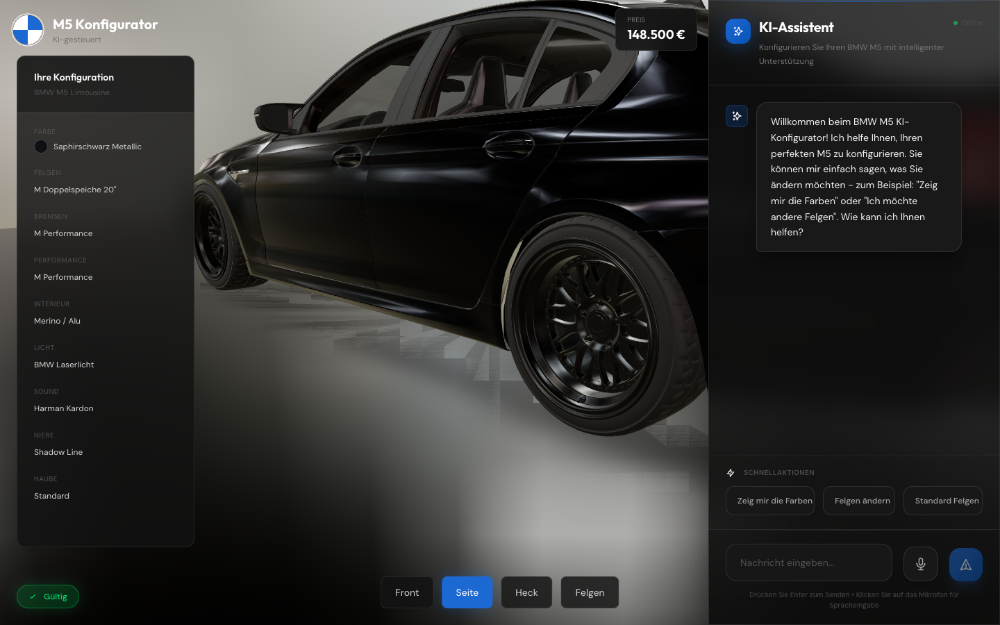
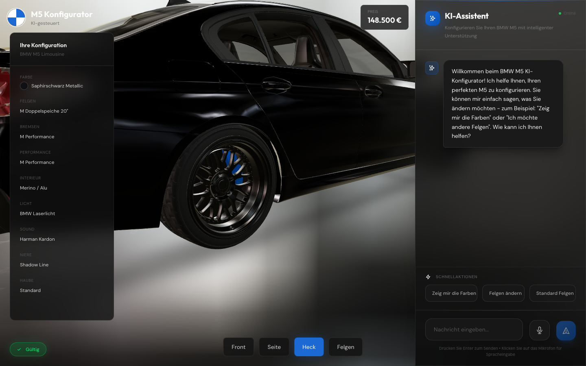
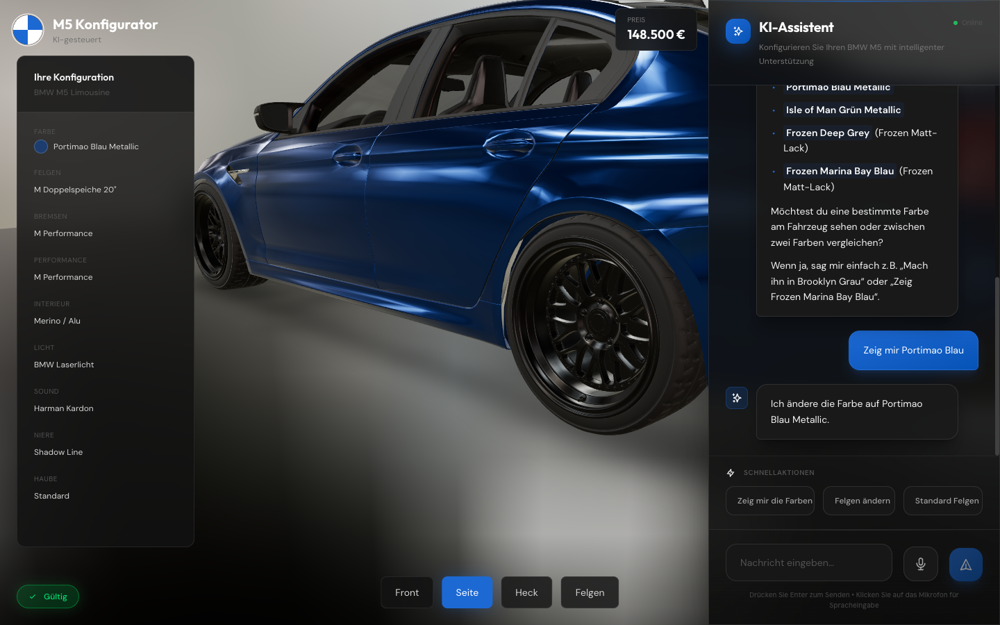
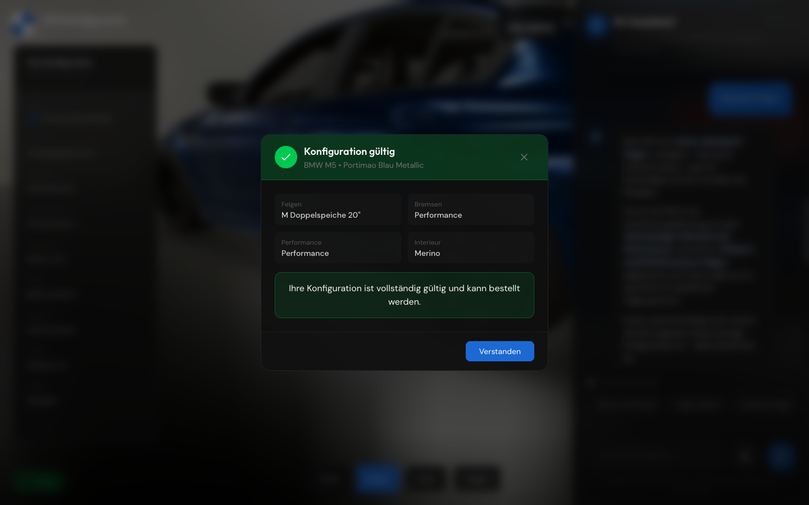

# BMW M5 AI Configurator

An intelligent 3D car configurator for the BMW M5, powered by **OpenAI GPT-5.1** and **React Three Fiber**. This demo showcases how AI can intelligently handle **2^40 possible configuration combinations** with real-time 3D visualization and constraint-based validation.



---

## Table of Contents

- [Overview](#overview)
- [Screenshots](#screenshots)
- [Features](#features)
- [Architecture](#architecture)
- [Data Flow](#data-flow)
- [Technology Stack](#technology-stack)
- [Project Structure](#project-structure)
- [Setup & Installation](#setup--installation)
- [Configuration Options](#configuration-options)
- [Constraint System](#constraint-system)
- [AI Integration](#ai-integration)
- [Component Documentation](#component-documentation)
- [Available Commands](#available-commands)
- [Demo Mode](#demo-mode)
- [Building for Production](#building-for-production)
- [License](#license)

---

## Overview

The BMW M5 AI Configurator is a **production-ready demo** that demonstrates:

1. **AI-Powered Configuration** - Natural language interaction using GPT-5.1 with function calling
2. **Real-time 3D Visualization** - Dynamic material updates on a detailed BMW M5 model
3. **Intelligent Constraint System** - 8 validation rules that enforce BMW M5 compatibility
4. **Voice Input Support** - Configure your car using voice commands in German
5. **Context-Aware Conversations** - AI remembers conversation context for natural follow-ups

### Why This Demo Matters

Enterprise car configurators face the challenge of managing millions of possible combinations while ensuring valid configurations. This demo shows how AI can:

- **Reduce complexity** - Natural language replaces complex UI interactions
- **Explain decisions** - AI tells users WHY something isn't available
- **Suggest alternatives** - When blocking a configuration, AI offers valid options
- **Maintain context** - Understands "change it to white" based on previous messages

---

## Screenshots

### Main Interface


### AI Chat Interaction


### Configuration Validation


### 3D Model Views
| Front View | Side View | Rear View |
|------------|-----------|-----------|
|  |  |  |

### Color Options


---

## Features

### 1. AI-Powered Configuration
- **OpenAI GPT-5.1** integration with function calling
- Context-aware conversation (understands previous messages)
- German language support with proper localization
- Explains M5 benefits when rejecting incompatible configs

### 2. 3D Visualization
- Real-time BMW M5 model rendering
- **Dynamic body color** (8 colors available)
- **Wheel rendering** (4 M Sport/Performance options)
- **Grille/Niere color** (5 options)
- **Hood pattern** (5 patterns)
- **5 camera positions**: Front, Side, Rear, Interior, Wheels
- Smooth camera animations with easing functions
- OrbitControls for manual rotation

### 3. Intelligent Constraint System
- **8 validation rules** with blocking/warning severity
- Real-time validation on every change
- Detailed explanations for violations
- Suggested fixes with alternatives

### 4. Voice Input
- Web Speech API integration
- German language (de-DE)
- Real-time transcription
- Auto-submit after voice input

### 5. Demo Mode
- **Works without API key** - Intelligent fallback logic
- Full constraint validation offline
- Pre-programmed intelligent responses

---

## Architecture

### High-Level Architecture Diagram

```
┌─────────────────────────────────────────────────────────────────────────┐
│                           USER INTERFACE LAYER                           │
├─────────────────────┬───────────────────────────┬───────────────────────┤
│   Left Sidebar      │     3D Scene (Center)     │    Chat Panel (Right) │
│   ┌─────────────┐   │   ┌───────────────────┐   │   ┌─────────────────┐ │
│   │ConfigSummary│   │   │  React Three Fiber│   │   │   ChatPanel     │ │
│   │             │   │   │                   │   │   │                 │ │
│   │• Config     │   │   │  ┌─────────────┐  │   │   │ • Messages      │ │
│   │• Colors     │   │   │  │  BMW M5 GLB │  │   │   │ • Voice Input   │ │
│   │• Wheels     │   │   │  │    Model    │  │   │   │ • Function Calls│ │
│   │• Interior   │   │   │  └─────────────┘  │   │   │ • AI Responses  │ │
│   │• Validation │   │   │                   │   │   │                 │ │
│   └─────────────┘   │   │  • Dynamic Mats   │   │   └─────────────────┘ │
│                     │   │  • 5 Camera Pos   │   │                       │
│   264px width       │   │  • OrbitControls  │   │      420px width      │
└─────────────────────┴───────────────────────────┴───────────────────────┘
                                    │
                                    ▼
┌─────────────────────────────────────────────────────────────────────────┐
│                           STATE LAYER (Zustand)                          │
├─────────────────────────────────────────────────────────────────────────┤
│                                                                          │
│   ┌──────────────┐  ┌────────────────┐  ┌─────────────┐  ┌───────────┐  │
│   │ Config State │  │ Validation     │  │ Chat        │  │ UI State  │  │
│   │              │  │ State          │  │ Messages    │  │           │  │
│   │ • color      │  │                │  │             │  │ • loading │  │
│   │ • wheels     │  │ • isValid      │  │ • history[] │  │ • camera  │  │
│   │ • interior   │  │ • blockers[]   │  │ • context   │  │ • overlay │  │
│   │ • brakes     │  │ • warnings[]   │  │             │  │           │  │
│   │ • grill      │  │                │  │             │  │           │  │
│   │ • hood       │  │                │  │             │  │           │  │
│   └──────────────┘  └────────────────┘  └─────────────┘  └───────────┘  │
│                                                                          │
└─────────────────────────────────────────────────────────────────────────┘
                                    │
                    ┌───────────────┼───────────────┐
                    │               │               │
                    ▼               ▼               ▼
┌───────────────────────┐ ┌─────────────────┐ ┌─────────────────────────┐
│   Constraint System   │ │ Validation      │ │     AI Service          │
│                       │ │ Engine          │ │                         │
│ ┌───────────────────┐ │ │                 │ │ ┌─────────────────────┐ │
│ │ BMW_M5_CONSTRAINTS│ │ │ • Validates     │ │ │ OpenAI GPT-5.1      │ │
│ │                   │ │ │ • Suggests fixes│ │ │                     │ │
│ │ • 8 Rules         │ │ │ • Explains why  │ │ │ • Function Calling  │ │
│ │ • Block/Warn      │ │ │                 │ │ │ • System Prompt     │ │
│ │ • 2^40 combos     │ │ │                 │ │ │ • Demo Mode         │ │
│ └───────────────────┘ │ │                 │ │ └─────────────────────┘ │
└───────────────────────┘ └─────────────────┘ └─────────────────────────┘
```

### Component Relationship Diagram

```
                              ┌─────────────┐
                              │   App.tsx   │
                              │  (Layout)   │
                              └──────┬──────┘
                                     │
            ┌────────────────────────┼────────────────────────┐
            │                        │                        │
            ▼                        ▼                        ▼
    ┌───────────────┐        ┌─────────────┐        ┌─────────────────┐
    │ConfigSummary  │        │  Scene.tsx  │        │  ChatPanel.tsx  │
    │               │        │  (3D Canvas)│        │                 │
    │ Reads config  │        └──────┬──────┘        │ • useVoiceInput │
    │ from store    │               │               │ • sendMessage   │
    └───────────────┘               │               └────────┬────────┘
                                    │                        │
                             ┌──────┴──────┐                 │
                             │             │                 │
                             ▼             ▼                 ▼
                     ┌─────────────┐ ┌──────────┐    ┌──────────────┐
                     │BMWModel.tsx │ │ Camera   │    │ openai.ts    │
                     │             │ │ Controls │    │              │
                     │• Materials  │ └──────────┘    │• GPT-5.1     │
                     │• Categories │                 │• Functions   │
                     │• Updates    │                 │• Demo Mode   │
                     └──────┬──────┘                 └──────┬───────┘
                            │                               │
                            │         ┌─────────────────────┤
                            │         │                     │
                            ▼         ▼                     ▼
                     ┌─────────────────────┐        ┌──────────────┐
                     │   configStore.ts    │        │constraints.ts│
                     │      (Zustand)      │◄───────│              │
                     │                     │        │ • 8 Rules    │
                     │ • State             │        │ • Validation │
                     │ • Actions           │        └──────────────┘
                     │ • Auto-validation   │
                     └─────────────────────┘
```

---

## Data Flow

### User Interaction Flow

```
┌─────────────────────────────────────────────────────────────────────────┐
│                          USER INPUT FLOW                                 │
└─────────────────────────────────────────────────────────────────────────┘

User Input (Text/Voice)
        │
        ▼
┌───────────────────┐
│ ChatPanel.tsx     │  Captures user message
│ • Text input      │  or voice transcription
│ • Voice button    │
└─────────┬─────────┘
          │
          ▼
┌───────────────────────────────────────────────────────────────┐
│                    AI SERVICE (openai.ts)                      │
├───────────────────────────────────────────────────────────────┤
│                                                                │
│   ┌─────────────────┐    ┌─────────────────┐                  │
│   │  System Prompt  │    │  Config Context │                  │
│   │  (German)       │    │  (Current state)│                  │
│   └────────┬────────┘    └────────┬────────┘                  │
│            │                      │                            │
│            └──────────┬───────────┘                            │
│                       ▼                                        │
│              ┌─────────────────┐                               │
│              │   GPT-5.1 API   │                               │
│              │  Function Call  │                               │
│              └────────┬────────┘                               │
│                       │                                        │
│   ┌───────────────────┼───────────────────────────────────┐   │
│   │                   │                                   │   │
│   ▼                   ▼                   ▼               ▼   │
│ change_color    change_wheels    change_interior    move_camera
│ change_brakes   change_grill     change_hood        validate   │
│                                                                │
└───────────────────────────┬───────────────────────────────────┘
                            │
                            ▼
┌───────────────────────────────────────────────────────────────┐
│              FUNCTION EXECUTION (openai.ts)                    │
│                                                                │
│   executeOpenAIFunctionCall(name, args, config)               │
│                       │                                        │
│                       ▼                                        │
│   Returns: { configUpdate?, cameraPosition?, showValidation? }│
└───────────────────────────┬───────────────────────────────────┘
                            │
                            ▼
┌───────────────────────────────────────────────────────────────┐
│                    STORE UPDATE (Zustand)                      │
│                                                                │
│   configStore.updateConfig(updates)                           │
│                       │                                        │
│                       ▼                                        │
│   ┌─────────────────────────────────────────────────────────┐ │
│   │           AUTO-VALIDATION TRIGGERED                      │ │
│   │                                                          │ │
│   │   validateConfiguration(newConfig)                       │ │
│   │           │                                              │ │
│   │           ▼                                              │ │
│   │   ┌─────────────────────────────────────┐               │ │
│   │   │ Check BMW_M5_CONSTRAINTS (8 rules)  │               │ │
│   │   │ • M5 requires M wheels              │               │ │
│   │   │ • Competition needs 21"             │               │ │
│   │   │ • Ceramic needs performance pkg     │               │ │
│   │   │ • ...                               │               │ │
│   │   └─────────────────┬───────────────────┘               │ │
│   │                     ▼                                    │ │
│   │   { isValid, blockers[], warnings[] }                   │ │
│   └─────────────────────────────────────────────────────────┘ │
└───────────────────────────┬───────────────────────────────────┘
                            │
                            ▼
┌───────────────────────────────────────────────────────────────┐
│                  COMPONENT RE-RENDER                           │
│                                                                │
│   Zustand subscriptions trigger updates:                      │
│                                                                │
│   ┌─────────────┐  ┌─────────────┐  ┌─────────────────────┐  │
│   │ BMWModel    │  │ConfigSummary│  │ValidationOverlay    │  │
│   │             │  │             │  │                     │  │
│   │ Updates     │  │ Updates     │  │ Shows valid/invalid │  │
│   │ materials   │  │ display     │  │ badge + details     │  │
│   └─────────────┘  └─────────────┘  └─────────────────────┘  │
│                                                                │
└───────────────────────────────────────────────────────────────┘
                            │
                            ▼
┌───────────────────────────────────────────────────────────────┐
│                    3D SCENE UPDATE                             │
│                                                                │
│   BMWModel.tsx applies materials based on category:           │
│                                                                │
│   ┌─────────────────────────────────────────────────────────┐ │
│   │  Material Categories (12 types):                         │ │
│   │                                                          │ │
│   │  • body      → config.color.hex                         │ │
│   │  • wheel     → wheel material                           │ │
│   │  • grille    → config.grillColor.hex                    │ │
│   │  • glass     → transparent dark                         │ │
│   │  • taillight → red transparent                          │ │
│   │  • headlight → clear reflective                         │ │
│   │  • chrome    → highly reflective metal                  │ │
│   │  • badge     → PRESERVE ORIGINAL (BMW roundel)          │ │
│   │  • interior  → dark leather                             │ │
│   │  • tire      → matte black rubber                       │ │
│   │  • caliper   → BMW M blue                               │ │
│   │  • carbon    → dark carbon fiber                        │ │
│   └─────────────────────────────────────────────────────────┘ │
│                                                                │
│   Car updates in real-time!                                   │
└───────────────────────────────────────────────────────────────┘
```

---

## Technology Stack

| Category | Technology | Version | Purpose |
|----------|------------|---------|---------|
| **Frontend** | React | 19 | UI framework |
| | TypeScript | 5.9 | Type safety |
| | Vite | 7.2 | Build tool |
| **3D Graphics** | Three.js | 0.181 | WebGL rendering |
| | React Three Fiber | 9.4 | React renderer for Three.js |
| | @react-three/drei | 10.7 | Helpers (controls, environment) |
| **AI** | OpenAI SDK | 6.9.1 | GPT-5.1 integration |
| | Google Generative AI | 0.24.1 | Gemini fallback |
| **State** | Zustand | 5.0.9 | State management |
| **UI** | Framer Motion | 12.23 | Animations |
| | Tailwind CSS | 4.1 | Styling |
| **Voice** | Web Speech API | Native | Voice recognition |

---

## Project Structure

```
bmw-configurator-demo/
│
├── src/
│   ├── App.tsx                    # Main layout component
│   ├── main.tsx                   # React entry point
│   ├── index.css                  # Global styles (Tailwind + custom)
│   │
│   ├── components/
│   │   ├── 3d/
│   │   │   ├── Scene.tsx          # 3D canvas, camera, lighting
│   │   │   └── BMWModel.tsx       # Car model with dynamic materials
│   │   │
│   │   ├── chat/
│   │   │   └── ChatPanel.tsx      # AI chat interface + voice
│   │   │
│   │   └── ui/
│   │       ├── Header.tsx         # Logo, title, price
│   │       ├── ConfigSummary.tsx  # Left sidebar config display
│   │       └── ValidationOverlay.tsx # Validation badge + modal
│   │
│   ├── services/
│   │   ├── openai.ts              # GPT-5.1 integration
│   │   │                          # • Function calling
│   │   │                          # • Demo mode fallback
│   │   │                          # • German system prompt
│   │   └── gemini.ts              # Gemini fallback service
│   │
│   ├── stores/
│   │   └── configStore.ts         # Zustand state management
│   │                              # • Config state
│   │                              # • Actions (setColor, setWheels, etc.)
│   │                              # • Auto-validation
│   │
│   ├── config/
│   │   └── constraints.ts         # BMW M5 validation rules
│   │                              # • 8 constraint rules
│   │                              # • Validation engine
│   │
│   ├── types/
│   │   └── index.ts               # TypeScript definitions
│   │                              # • CarConfig, ColorOption, etc.
│   │                              # • Available options (static data)
│   │
│   └── hooks/
│       └── useVoiceInput.ts       # Web Speech API hook
│
├── public/
│   └── models/
│       └── bmw-m5.glb             # 3D BMW M5 model
│
├── screenshots/                    # README screenshots
│
├── .env.example                    # Environment template
├── package.json                    # Dependencies
├── tsconfig.json                   # TypeScript config
├── vite.config.ts                  # Vite config (port 5176)
└── README.md                       # This file
```

---

## Setup & Installation

### Prerequisites

- Node.js 18+
- npm or yarn
- OpenAI API key (optional - demo mode works without it)

### Quick Start

```bash
# 1. Clone the repository
git clone <repo-url>
cd bmw-configurator-demo

# 2. Install dependencies
npm install

# 3. Configure API keys (optional)
cp .env.example .env
# Edit .env and add your OpenAI API key

# 4. Run development server
npm run dev

# 5. Open in browser
# http://localhost:5176
```

### Environment Variables

```env
# OpenAI API Key (recommended)
# Get from: https://platform.openai.com/api-keys
VITE_OPENAI_API_KEY=sk-proj-your-key-here

# Gemini API Key (optional fallback)
# Get from: https://makersuite.google.com/app/apikey
VITE_GEMINI_API_KEY=your-gemini-key-here
```

> **Note:** The app works without API keys using Demo Mode with intelligent pattern matching.

---

## Configuration Options

### Available Colors

| Category | Color | Hex | Price |
|----------|-------|-----|-------|
| **Solid** | Alpinweiß | `#f5f5f5` | €0 |
| | Schwarz | `#1a1a1a` | €0 |
| **Metallic** | Saphirschwarz Metallic | `#0f0f14` | €1,200 |
| | Brooklyn Grau Metallic | `#4a4a4f` | €1,200 |
| | Portimao Blau Metallic | `#1c3d6e` | €1,200 |
| | Isle of Man Grün Metallic | `#1a3d2e` | €1,500 |
| **BMW Individual** | Frozen Deep Grey | `#3a3a3a` | €4,500 |
| | Frozen Marina Bay Blau | `#1c4d7a` | €4,500 |

### Available Wheels

| Type | Wheel | Size | Price |
|------|-------|------|-------|
| **M Sport** | M Doppelspeiche | 20" | €1,800 |
| | M Sternspeiche | 21" | €2,400 |
| | M Y-Speiche | 21" | €2,800 |
| **M Performance** | M Performance Geschmiedet | 21" | €4,200 |

> **Note:** Standard 19" wheels are NOT available for the M5!

### Interior Options

**Leather Types:**
- Vernasca
- Merino
- Extended Merino (M5 exclusive)

**Colors:**
- Schwarz, Cognac, Silverstone, Fiona Rot, Elfenbeinweiß, Alpinweiß

**Trim Materials:**
- Aluminium Rhombicle, Edelholz Eiche, M Carbon

### Grille/Niere Colors

| Color | Price |
|-------|-------|
| Chrom | €0 |
| Schwarz Hochglanz | €350 |
| Shadow Line | €650 |
| Cerium Grau | €450 |
| Gold Bronze | €850 |

### Hood Patterns

| Pattern | Description | Price |
|---------|-------------|-------|
| Standard | Unifarben ohne Muster | €0 |
| Carbon Fiber | Sichtbare Carbonfaser-Optik | €2,800 |
| M Streifen | BMW M Farbstreifen | €450 |
| Racing Stripes | Mittige Rennstreifen | €650 |
| Matte Finish | Matte Lackierung | €1,200 |

---

## Constraint System

The BMW M5 has specific configuration requirements enforced by 8 validation rules:

### Blocking Rules (Cannot Order)

| Rule | Description | Severity |
|------|-------------|----------|
| M5_REQUIRES_M_WHEELS | M5 requires M Sport/M Performance wheels | BLOCK |
| M_COMPETITION_21_INCH | Competition package requires 21" wheels | BLOCK |
| CERAMIC_BRAKES_PERFORMANCE | Ceramic brakes require performance package | BLOCK |
| FROZEN_COLOR_M5 | Frozen colors are exclusive to M5 | BLOCK |
| MERINO_LEATHER_M5 | Extended Merino leather is M5 exclusive | BLOCK |

### Warning Rules (Recommended)

| Rule | Description | Severity |
|------|-------------|----------|
| CARBON_TRIM_PERFORMANCE | Carbon trim recommended with performance package | WARN |
| DRIVING_ASSIST_PRO_LASER | Driving Assistant Pro requires laser lights | WARN |
| HARMAN_KARDON_MIN | M5 includes Harman Kardon as minimum | WARN |

### Validation Display



- **Green Badge** - Configuration is valid and can be ordered
- **Yellow Badge** - Warnings present but configuration is valid
- **Red Badge** - Blockers present, configuration cannot be ordered

---

## AI Integration

### GPT-5.1 Function Calling

The AI uses **9 function tools** to interact with the configurator:

```typescript
// Available AI Functions
change_color({ colorId: string })
change_wheels({ wheelId: string })
change_interior({ leather?, color?, trim? })
change_brakes({ brakes: string })
change_grill_color({ grillColorId: string })
change_hood_pattern({ hoodPatternId: string })
set_performance_package({ package: string })
move_camera({ position: string })
validate_configuration()
```

### AI Behavior

When a user requests an incompatible configuration (e.g., "I want standard wheels"), the AI:

1. **Explains WHY** it's not possible
2. **Lists 4 M5 Benefits** that justify the requirement
3. **Suggests Alternatives** that are compatible

**M5 Benefits Highlighted:**
1. 625 PS V8 Twin-Turbo Motor - Exceptional performance
2. M xDrive All-Wheel Drive - Optimal traction
3. Adaptive M Suspension - Perfect balance
4. Exclusive M Performance Components - Race-track tested

### Context Awareness

The AI maintains conversation context:

```
User: "Change the interior to brown"
AI: "I'm changing the interior color to Cognac..."

User: "Actually, make it white"
AI: "I'm changing the interior color to Alpinweiß..."
     ↑ Understands "white" refers to interior, not exterior
```

---

## Component Documentation

### BMWModel.tsx

The 3D car model component with **12 material categories**:

```typescript
type MeshCategory =
  | 'body'      // Exterior panels → config.color
  | 'glass'     // Windows → dark transparent
  | 'taillight' // Rear lights → red transparent
  | 'headlight' // Front lights → clear
  | 'wheel'     // Rims → metallic silver
  | 'tire'      // Rubber → matte black
  | 'caliper'   // Brakes → BMW M blue
  | 'interior'  // Cabin → dark leather
  | 'grille'    // Kidney grille → config.grillColor
  | 'badge'     // BMW logo → PRESERVED (original texture)
  | 'carbon'    // Carbon parts → dark textured
  | 'chrome'    // Trim → highly reflective
  | 'other';    // Misc → original materials
```

### ConfigStore (Zustand)

```typescript
interface ConfigStore {
  // State
  config: CarConfig;
  validationResult: ValidationResult;
  messages: ChatMessage[];
  ui: UIState;

  // Actions
  updateConfig(updates: Partial<CarConfig>): void;
  setColor(colorId: string): void;
  setWheels(wheelId: string): void;
  setInterior(updates: Partial<InteriorConfig>): void;
  setGrillColor(grillColorId: string): void;
  setHoodPattern(hoodPatternId: string): void;
  setCameraPosition(position: CameraPosition): void;
  // ... more actions
}
```

---

## Available Commands

Try these German commands in the chat:

### Color Commands
- "Zeig mir die Farben" - Show available colors
- "Ändere die Farbe auf Portimao Blau" - Change to Portimao Blue
- "Ich möchte Frozen Marina Bay" - Change to Frozen Marina Bay

### Wheel Commands
- "Zeig mir die Felgen" - Show available wheels
- "M Performance Felgen" - Change to M Performance wheels
- "Standard Felgen" - (Will be rejected with M5 benefits explanation!)

### Interior Commands
- "Zeig mir das Interieur" - Show interior options
- "Cognac Leder" - Change to Cognac leather
- "Carbon Zierleisten" - Change to carbon trim

### Styling Commands
- "Zeig mir die Nierenfarben" - Show grille colors
- "Shadow Line Niere" - Change grille to Shadow Line
- "Carbon Motorhaube" - Change to carbon fiber hood

### View Commands
- "Zeig mir die Front" - Front view
- "Seitenansicht" - Side view
- "Heckansicht" - Rear view

### Validation
- "Prüfe die Konfiguration" - Validate configuration

---

## Demo Mode

When no API key is configured, the app operates in **Demo Mode**:

### Features Available Offline
- All configuration changes work
- Full validation system
- Pattern-based command recognition
- Camera controls
- Pre-programmed intelligent responses

### Demo Mode Logic

```typescript
// Pattern matching for colors
"portimao blau" → change_color('portimao-blue')
"grün" → change_color('isle-of-man-green')

// Context-aware follow-ups
lastTopic: 'interior'
"weiß" → change_interior({ color: 'Alpinweiß' })

// Blocking with explanation
"standard felgen" → Explains M5 requirements + benefits
```

---

## Building for Production

```bash
# Build for production
npm run build

# Preview production build
npm run preview

# Type checking
npm run type-check

# Linting
npm run lint
```

### Production Output

```
dist/
├── index.html
├── assets/
│   ├── index-[hash].js      # Main bundle
│   ├── index-[hash].css     # Styles
│   └── vendor-[hash].js     # Dependencies
└── models/
    └── bmw-m5.glb           # 3D model
```

---

## License

MIT

---

## Credits

Built with:
- **OpenAI GPT-5.1** - AI function calling
- **React Three Fiber** - 3D rendering
- **Zustand** - State management
- **Tailwind CSS** - Styling
- **Framer Motion** - Animations

---

## Contributing

1. Fork the repository
2. Create a feature branch (`git checkout -b feature/amazing-feature`)
3. Commit your changes (`git commit -m 'Add amazing feature'`)
4. Push to the branch (`git push origin feature/amazing-feature`)
5. Open a Pull Request

